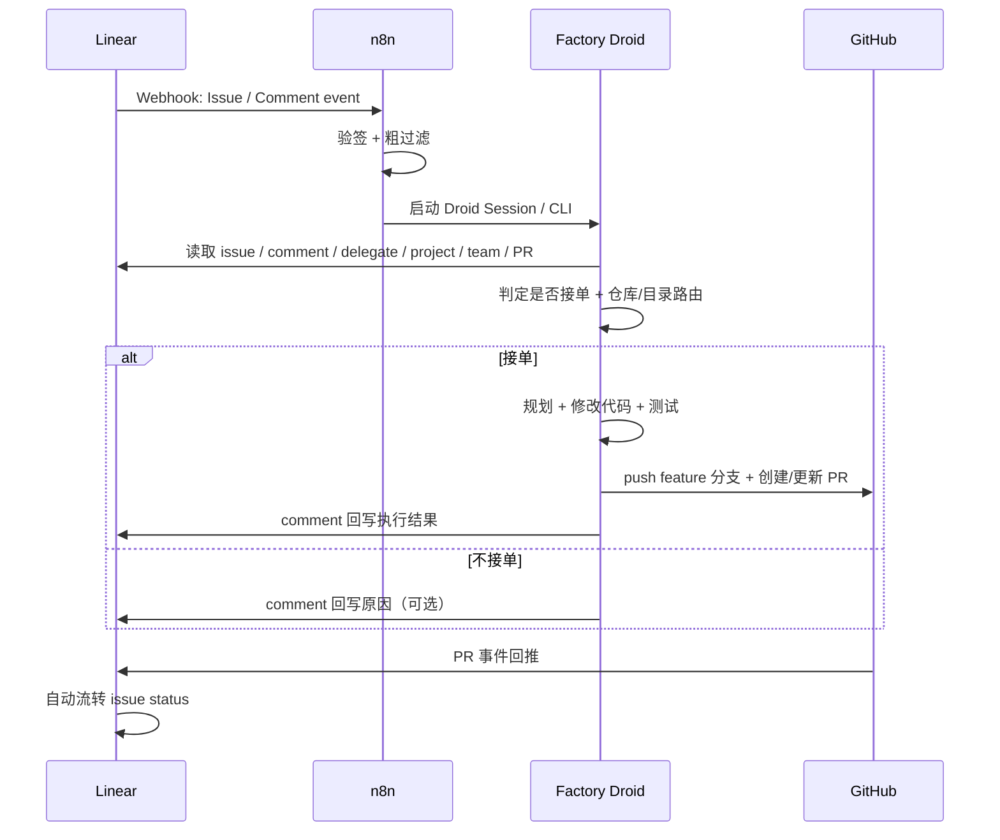
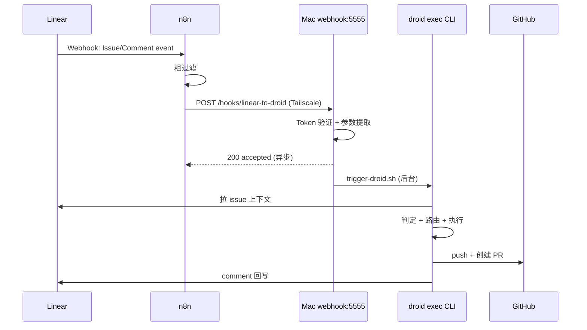

# Linear × Factory Droid 最终实施规范

## 1. 目标

建立一条稳定、简洁、可扩展的执行链路：

- Linear 负责承载 issue、触发事件、展示结果
- n8n 负责接 webhook 并唤醒 Droid
- Factory Droid 负责拉上下文、判断是否接单、执行代码、创建 GitHub PR、回写 Linear
- GitHub PR 驱动 issue status 自动流转

核心原则：

**Webhook = 门铃，Droid = 自治执行者。**

---

## 2. 最终架构



---

## 3. 职责边界

## 3.1 Linear

负责：
- issue / comment / project 数据承载
- webhook 事件推送
- 展示 Droid 回写结果
- 通过 GitHub 集成自动推进 status

不负责：
- 代码执行
- 仓库路由
- Droid 任务编排

## 3.2 n8n

负责：
- 接收 webhook
- 验签
- 粗过滤
- 提取最小字段
- 启动 Droid

不负责：
- 仓库路由
- issue 全量解析
- 业务最终判定
- comment 回写

一句话：

**n8n 不做脑子，只做唤醒。**

## 3.3 Factory Droid

负责：
- 读取 Linear 完整上下文
- 最终判断是否接单
- 路由目标仓库 / 子目录
- 修改代码
- 创建或更新 GitHub PR
- 回写 Linear comment

## 3.4 GitHub ↔ Linear 集成

负责：
- PR open → `In Progress`
- Review requested / activity → `In Review`
- PR merge → `Done`

Droid 不直接把 issue 改为 `Done`。

---

## 4. 触发方式

## 4.1 Linear Webhook

建议启用以下事件：
- Issue create
- Issue update
- Comment create

Webhook 指向 n8n：

```text
https://your-n8n.example.com/webhook/linear-factory
```

并配置签名 secret 供 n8n 验签。

---

## 5. n8n 工作流规范

## 5.1 n8n 只保留最小上下文

### Issue 事件最小字段

```json
{
  "eventType": "Issue.update",
  "action": "update",
  "issueRef": "INFRA-2",
  "issueUuid": "optional-if-available",
  "teamKey": "INFRA",
  "triggerSource": "issue",
  "changedFields": ["assignee", "delegate", "description"]
}
```

### Comment 事件最小字段

```json
{
  "eventType": "Comment.create",
  "action": "create",
  "issueRef": "INFRA-2",
  "issueUuid": "optional-if-available",
  "teamKey": "INFRA",
  "triggerSource": "comment",
  "commentUuid": "optional-if-available"
}
```

## 5.2 粗过滤规则

放行逻辑：
- issue create
- issue update
- comment create

可选进一步过滤：
- issue 属于目标 team
- issue 的 assignee / delegate / comment / status 等关键字段变化
- comment 可能提到 `Factory`

**注意：**
不要在 n8n 把以下条件写死为唯一依据：
- `assignee.name == "Factory"`
- `body contains "@Factory"`

这些都只能作为线索。

---

## 6. Droid 启动方式

支持两种模式。

## 6.1 方式 A：Factory Session API

### 创建 session

```json
{
  "computerId": "<computer-id>",
  "sessionSettings": {
    "model": "<preferred-model>",
    "interactionMode": "auto",
    "autonomyLevel": "medium"
  },
  "tags": [
    {
      "name": "linear-gateway",
      "metadata": {
        "issueRef": "INFRA-2",
        "issueUuid": "<optional>",
        "teamKey": "INFRA",
        "triggerSource": "issue",
        "eventType": "Issue.update"
      }
    }
  ]
}
```

### 门铃消息

```json
{
  "text": "Linear 门铃触发。IssueRef=INFRA-2。请按 linear-gateway 执行。"
}
```

## 6.2 方式 B：直接执行 droid CLI

> **注意：** `droid exec` 不支持 `--skill`、`--issue-ref` 等自定义参数。
> 参数通过 `--tag` JSON + prompt 文本传递。

```bash
droid exec \
  --tag '{"name":"linear-gateway","metadata":{"issueRef":"INFRA-2","teamKey":"INFRA","triggerSource":"issue","eventType":"Issue.update"}}' \
  --auto medium \
  --output-format json \
  "Linear 门铃触发。IssueRef=INFRA-2。请按 linear-gateway skill 执行。"
```

**参数传递方式：**
- `--tag` — JSON 格式，传递结构化元数据（issueRef / teamKey / triggerSource / eventType）
- prompt 文本 — 显式提及 skill 名称，触发语义匹配加载
- 环境变量 — LINEAR_API_KEY 等凭证类参数

**方式对比：**

| 维度 | 方式 A：Session API | 方式 B：droid exec CLI |
|------|---------------------|----------------------|
| 适合场景 | n8n 生产环境 | 本地调试 / 脚本触发 |
| 依赖 | 只需 HTTP + API Key | 需安装 droid CLI |
| 参数传递 | JSON body + tags | --tag + prompt |
| 输出控制 | 需轮询 session 状态 | --output-format json 直接返回 |
| 推荐用途 | **n8n 生产首选** | 开发调试用 |

---

## 7. Droid CLI / Session 输入规范

## 7.1 参数传递规范

> `droid exec` 不支持自定义 flag，所有参数通过以下方式传递：

### 方式 A（Session API）：通过 JSON body 传递

| 参数位置 | 参数 | 必填 | 说明 |
|----------|------|------|------|
| tags[0].metadata | issueRef | 是 | issue identifier，例如 `INFRA-2` |
| tags[0].metadata | issueUuid | 否 | issue UUID |
| tags[0].metadata | teamKey | 否 | team key，例如 `INFRA` |
| tags[0].metadata | triggerSource | 是 | `issue` / `comment` |
| tags[0].metadata | eventType | 是 | `Issue.create` / `Issue.update` / `Comment.create` |
| tags[0].metadata | commentUuid | 否 | comment 触发时传入 |
| 消息 text | skill 名称 | 是 | 在 prompt 文本中提及 `linear-gateway` |

### 方式 B（droid exec CLI）：通过 --tag + prompt 传递

```bash
--tag '{"name":"linear-gateway","metadata":{"issueRef":"INFRA-2",...}}'
```

### 环境变量（两种方式共用）

```bash
LINEAR_API_KEY=lin_api_xxx
LINEAR_API_URL=https://api.linear.app/graphql
LINEAR_TEAM_WHITELIST=default,infra,gateway,workbot
FACTORY_RUN_ROOT=~/factory/runs
REPO_CONFIG_PATH=~/.factory/config/repositories.yml
```

---

## 8. Droid 自治执行逻辑

## 8.1 总原则

- 不依赖 webhook 直接传入的 issue 内容
- 所有关键判断都通过 Linear API 二次确认
- 不在上下文不完整时直接修改代码
- 不直接把 issue 改为 `Done`
- 状态流转优先交给 GitHub ↔ Linear 自动化

## 8.2 拉取上下文

Droid 启动后必须读取：
- title
- description
- team
- project
- labels
- assignee
- delegate
- comments
- current status
- 已有关联 PR / Git 链接

> **注意：** Linear API 中 issue 上的字段名是 `delegate`（类型 `User`），不是 `agent`。
> 查询时使用：`delegate { id name }`

若本次触发源是 comment，则必须重新读取最新 comment 内容，不只信任门铃消息。

## 8.3 最终接单判定

只有满足以下条件才执行代码：
- 任务明确指向 Factory
- team 在白名单内
- 属于代码修改类任务
- 当前没有冲突中的有效 PR，或应复用现有 PR

不满足时：
- 可选回写一条“未接单” comment
- 然后退出

## 8.4 执行规划

识别任务类型：
- bugfix
- feature
- refactor
- CI
- test

规划输出：
- repoPath
- targetSubPath
- defaultBranch
- branchName
- 验证方式

---

## 9. 仓库 / 子目录路由规范

不要在 n8n 里写死 `cwd`。

应由 Droid 根据以下信息路由：
- team
- project
- labels
- issue 标题/描述关键词
- 仓库映射表

## 9.1 推荐匹配优先级

1. `team + project`
2. `team + labels`
3. `team + 关键词`
4. `team 默认路径`
5. 无法确定 → 回写请求人工确认

## 9.2 YAML 配置示例

```yaml
version: 1

teams:
  infra:
    repos:
      - repoKey: monorepo
        repoPath: ~/repos/company-monorepo
        defaultBranch: main
        paths:
          - path: services/memory-core
            when:
              projectNames: ["memory-core"]
              labelsAny: ["backend", "infra"]
          - path: infra
            when:
              labelsAny: ["deploy", "ops", "ci"]

  gateway:
    repos:
      - repoKey: monorepo
        repoPath: ~/repos/company-monorepo
        defaultBranch: main
        paths:
          - path: apps/gateway
            when:
              teamOnly: true

  workbot:
    repos:
      - repoKey: monorepo
        repoPath: ~/repos/company-monorepo
        defaultBranch: main
        paths:
          - path: workers/workbot
            when:
              teamOnly: true
```

如无法唯一确定目标仓库或目录：
- 不执行代码
- 回写 comment 请求人工确认

---

## 10. 本地目录与 worktree 规范

## 10.1 目录结构

```text
~/repos/
  company-monorepo/
  infra-tools/

~/factory/runs/
  INFRA-2-20260601-103000/
  GW-15-20260601-104500/
```

## 10.2 命名规则

```text
{issueRef}-{timestamp}
```

示例：

```text
INFRA-2-20260601-103000
```

## 10.3 worktree 示例

```bash
REPO=~/repos/company-monorepo
RUN_DIR=~/factory/runs/INFRA-2-20260601-103000
BRANCH=factory/infra-2

git -C "$REPO" fetch origin
git -C "$REPO" worktree add "$RUN_DIR" -b "$BRANCH" origin/main
```

任务结束后：

```bash
git -C "$REPO" worktree remove "$RUN_DIR"
```

失败排障时可暂不清理。

---

## 11. GitHub PR 执行规则

Droid 执行代码后应：
- commit / push 到 feature 分支
- 创建或更新 GitHub PR（通过 gh CLI 或 API）
- PR 标题或描述必须关联 Linear issue ID
- PR 必须通过 ci-ok + droid-review 双门禁才能合并

建议：
- 分支名包含 Linear issue 标识（如 `factory/INFRA-2`）
- PR 描述中包含 `Closes INFRA-2` 或对应 issue ID

---

## 12. Linear 回写规则

## 12.1 回写责任

**由 Droid 自己在 session 内直接调 Linear API 回写。**

不要由 n8n 回写，不要依赖 stop hook 的外部回写服务。

## 12.2 回写内容

优先回写：
- comment（通过 `commentCreate` mutation）
- 必要时补 attachment（通过 `attachmentCreate` mutation，关联 PR 链接等）
- 必要时补 labels / 少量字段

不直接做：
- 手动把 issue 改为 `Done`

## 12.3 成功模板

```markdown
Factory Droid 已完成本轮执行。

**本次改动**
- 修复 / 实现：...
- 影响范围：...

**代码与 PR**
- 分支：`factory/INFRA-2`
- PR：[查看 PR](https://github.com/hdot123/memory/pull/N)

**验证结果**
- 单元测试：通过
- 构建：通过
- 其他检查：...

**风险与说明**
- ...

**下一步**
- 等待评审
- 如需补充修改，可直接在该 issue 继续说明
```

## 12.4 失败模板

```markdown
Factory Droid 本轮执行失败，未完成代码提交。

**失败位置**
- 阶段：仓库路由 / 拉取代码 / 修改代码 / 测试 / 推送 / 创建 PR

**错误摘要**
- ...

**当前判断**
- 阻塞原因：...
- 是否可自动重试：是 / 否

**需要人工补充的信息**
- 目标仓库或目录
- 预期行为说明
- 环境或凭证确认
```

## 12.5 未接单模板

```markdown
Factory Droid 本次未接单。

- 原因：当前任务不满足自动执行条件
- 判断依据：未明确委派给 Factory / 无法确定目标仓库 / 已存在进行中的有效 PR / 当前任务不是代码修改类任务
- 建议：补充说明后再次触发
```

---

## 13. Linear API 使用原则

Droid 通过 `LINEAR_API_KEY` 直接访问 Linear GraphQL API。

## 13.1 查询阶段

- 使用 webhook 提供的 issue 标识作为入口
- 先查 issue
- 获取稳定主键
- 再进入后续逻辑

## 13.2 回写阶段

- 使用已确认的 issue 主键创建 comment
- 必要时更新少数字段
- 不直接把 issue 标记为完成

## 13.3 示例

### 查询 issue

```bash
curl -X POST "$LINEAR_API_URL" \
  -H "Authorization: Bearer $LINEAR_API_KEY" \
  -H "Content-Type: application/json" \
  -d '{
    "query": "query($id: String!) { issue(id: $id) { id identifier title description state { name } team { key name } project { id name } labels { nodes { name } } assignee { id name } delegate { id name } comments { nodes { id body createdAt user { name } } } } }",
    "variables": {
      "id": "INFRA-2"
    }
  }'
```

### 创建 comment

```bash
curl -X POST "$LINEAR_API_URL" \
  -H "Authorization: Bearer $LINEAR_API_KEY" \
  -H "Content-Type: application/json" \
  -d '{
    "query": "mutation($issueId: String!, $body: String!) { commentCreate(input: { issueId: $issueId, body: $body }) { success comment { id } } }",
    "variables": {
      "issueId": "<ISSUE_UUID>",
      "body": "Factory Droid 已完成本轮执行。PR: https://github.com/hdot123/memory/pull/..."
    }
  }'
```

> 实现时请把“identifier 查询”和“UUID 查询”分开封装，不要写死成一种。
>
> **补充说明：**
> - `issue(id: ...)` 同时接受 UUID 和人类可读 identifier（如 `INFRA-2`）
> - `labels` 和 `comments` 是 Relay-style connection，使用 `{ nodes { ... } }` 格式
> - `delegate` 字段类型是 `User`，不是 `agent`
> - Issue 类型上不存在 `links` 字段，外部链接（如 PR URL）通过 `attachmentCreate` mutation 关联

### 关联外部链接（PR 等）

```bash
curl -X POST "$LINEAR_API_URL" \
  -H "Authorization: Bearer $LINEAR_API_KEY" \
  -H "Content-Type: application/json" \
  -d '{
    "query": "mutation($issueId: String!, $title: String!, $url: String!) { attachmentCreate(input: { issueId: $issueId, title: $title, url: $url }) { success attachment { id } } }",
    "variables": {
      "issueId": "<ISSUE_UUID>",
      "title": "GitHub PR: factory/INFRA-2",
      "url": "https://github.com/hdot123/memory/pull/42"
    }
  }'
```

---

## 14. Agent / Guidance 规范

Factory 已作为 Linear agent 安装，且可访问所有 public teams。

建议在 guidance 中明确：
- Factory 是唯一执行代码修改的 agent
- 不依赖外部传入 issue 内容，必须自行通过 Linear API 拉上下文
- 仓库与目录必须通过映射规则自行判断
- 执行完成后直接调用 Linear API 回写 comment
- 不直接把 issue 改为 `Done`

---

## 15. 最小端到端联调步骤

建议基于 <project id="c0db65f2-b16a-4084-bea6-4a3b0ae68573">memory-core</project> 进行联调。

### 联调顺序

1. 确认 Linear webhook 已指向 n8n
2. 确认 n8n 能收到 issue / comment 事件
3. 确认 n8n 能成功启动 Droid
4. 确认 Droid 能用 `LINEAR_API_KEY` 拉到 issue 详情
5. 确认 Droid 能正确路由到 repo / subPath
6. 确认 Droid 能创建 GitHub PR
7. 确认 Droid 能回写成功 comment
8. 确认 GitHub → Linear 自动流转：
   - PR open → In Progress
   - review request → In Review
   - PR merge → Done

### 最小验收标准

- 委派给 Factory 后，Droid 确实被唤醒
- Droid 能拉到 issue 内容
- Droid 能识别 `memory-core` 对应仓库 / 目录
- Droid 能创建 PR
- Droid 能回写 comment
- Linear status 能随 GitHub PR 自动流转

---

## 16. 最终推荐结论

v1 实施方案固定如下：

- Linear webhook 负责门铃
- n8n 只负责唤醒 Droid
- Droid 自己拉 Linear API
- Droid 自己判断是否接单
- Droid 自己决定仓库 / 子目录
- Droid 自己修改代码并创建 PR
- Droid 自己 comment 回写
- GitHub PR 自动推进 issue status

一句话：

**Linear 发通知，n8n 只转发，Droid 自治执行，GitHub PR 驱动状态。**

---

## 附录 A：基建信息（已验证）

### A.1 GitHub 仓库

| 项目 | GitHub 路径 |
|------|------------|
| memory-core | `github.com/hdot123/memory` |

**CI 流程：** test → ci-ok + droid-review 双门禁（`.github/workflows/ci.yml` + `droid-review.yml`）

### A.2 Linear Teams

| Team | Key | ID | 默认 GitHub 仓库 |
|------|-----|----|-----------------|
| infra | INFRA | `6f378ffa-2cc9-4c5d-a131-efc7fba06485` | `hdot123/memory` |
| gateway | GW | `c5365a72-2574-4cc3-bd9e-0c9bd997e844` | （待迁移） |
| workbot | WB | `62318e54-d65f-42bd-8d31-7a1f0e146cae` | （待迁移） |

**Linear API：** `https://api.linear.app/graphql`
**认证方式：** `Authorization: <LINEAR_API_KEY>`（无 Bearer 前缀）

### A.3 1Password 凭证

所有凭证存储在 vault `sever`（ID: `ozqqpvh5yvvxvyu64npq62a3ti`）中。

**Linear 条目：**

| 字段 | 值 |
|------|-----|
| 条目标题 | `Linear / API Token` |
| Item ID | `elgcm2nzfza2hjb3yffpkijj7y` |
| Vault | `sever` |
| 标签 | `linear`, `api`, `secret`, `webhook` |
| 凭据字段 | `lin_api_3USLy...`（LINEAR_API_KEY） |
| Webhook URL | `https://webhook.exa.edu.kg/webhook/linear-factory`（指向 n8n） |
| Webhook Secret | 已配置（用于 webhook 签名验证） |

**读取方式：**
```bash
# CLI
op item get "elgcm2nzfza2hjb3yffpkijj7y" --vault "sever" --reveal --fields label=凭据

# MCP (Droid 优先)
read_secret(vault_id="ozqqpvh5yvvxvyu64npq62a3ti", item_id="elgcm2nzfza2hjb3yffpkijj7y", field_label="凭据")
```

### A.4 n8n 实例

| 实例 | 地址 | 状态 |
|------|------|------|
| 生产 | node-22: `43.167.177.86` / Tailscale `100.100.1.22:5678` | 活跃 |
| Webhook 入口 | `https://webhook.exa.edu.kg/webhook/events`（Cloudflare Tunnel） | 活跃 |

**已有相关工作流：**
- `dUB6UrDgZVyJoQgV` — unified provider webhooks（运行中）

### A.5 凭证管理

| 凭证 | 存储位置 | 用途 |
|------|----------|------|
| Linear API Token | 1Password `sever` / `elgcm2nzfza2hjb3yffpkijj7y` | Droid + n8n 读取 Linear |
| Linear Webhook URL | 同上条目 `Linear Webhook URL` 字段 | Linear → n8n 集成 |
| Linear Webhook Secret | 同上条目 `Linear Webhook secret` 字段 | 签名验证 |
| n8n API Key | 1Password `sever` / `ep3ovlbyava4ocix5rehqerjzm` | n8n 管理 API |
| Factory API Key | 1Password `sever` / n8n credential `CAoQRrdcqmpmS0Sn` | Session API 认证 |

### A.6 GitHub ↔ Linear 自动流转

**集成状态：** 已配置完成。

**Linear Webhook（Linear → n8n → Factory）：**

| ID | URL | Label | Enabled |
|----|-----|-------|---------|
| `dac0e211-3249-4c5a-a27d-d68e5c76923a` | `https://webhook.exa.edu.kg/webhook/linear-factory` | Factory Droid Gateway | ✅ |

- ResourceTypes: `Issue`, `Comment`（自动捕获 create/update/remove）
- Scope: `allPublicTeams: true`

**GitHub Integration（GitHub → Linear 自动流转）：**

通过 n8n 或第三方集成桥接 GitHub PR 事件到 Linear。

**流转链路：**
- PR open → Linear `In Progress`
- Review requested → Linear `In Review`
- PR merge → Linear `Done`

### A.7 n8n Workflow

**Linear Factory Gateway workflow 已导入：**

| 属性 | 值 |
|------|-----|
| Workflow ID | `zV3mKyKEI04AanmI` |
| 名称 | Linear Factory Gateway |
| 状态 | 非激活（需验证后激活） |
| Webhook 路径 | `/webhook/linear-factory` |
| Credential | `CAoQRrdcqmpmS0Sn`（Factory API Key，从 1Password 导入） |
| 节点数 | 7 个 |

**待完成：**
1. 配置 n8n 环境变量：`FACTORY_COMPUTER_ID`、`FACTORY_MODEL`
2. 在 n8n UI 中验证节点
3. 激活 workflow

### A.6 铁律

- 所有代码通过 feature 分支 + GitHub PR 提交
- 禁止 `git push origin main`（main 受保护）
- Feature 分支 + PR 是唯一提交流程
- 所有 commit 消息必须使用中文

---

## 附录 B：CLI 模式架构（已实施）

### B.1 架构变更

**原方案：** Linear → n8n → Factory Session API → Droid Session（因 computer 离线不可用）

**新方案：** Linear → n8n → Mac webhook (adnanh/webhook) → trigger-droid.sh → droid exec CLI → Linear API 回写



### B.2 为什么切换

| 问题 | 说明 |
|------|------|
| Factory Session API 返回 424 | computer 离线时无法创建 session |
| Computer 非常驻 | 本地 Mac 不是 7x24 服务器 |
| Session API 依赖在线 computer | 无法解耦执行环境 |

CLI 模式优势：
- 不依赖 Factory computer 在线状态
- 直接在本地 Mac 执行 droid exec
- adnanh/webhook 轻量级，launchd 管理自动重启
- 异步执行：收到请求立即返回，后台跑 droid

### B.3 部署文件清单

| 文件 | 路径 | 用途 |
|------|------|------|
| webhook binary | `~/.factory/webhook/bin/webhook` | v2.8.3 arm64（Homebrew 原生 Apple Silicon 版本） |
| hooks 配置 | `~/.factory/webhook/hooks.json` | 定义 linear-to-droid hook 的触发规则和参数映射 |
| 触发脚本 | `~/.factory/webhook/scripts/trigger-droid.sh` | 解析参数、路由仓库、后台执行 droid exec、回写 Linear |
| launchd plist | `~/Library/LaunchAgents/com.factory.webhook.plist` | 开机自启 + 崩溃自动重启 |
| 日志目录 | `~/.factory/webhook/logs/` | webhook-stderr.log + trigger-*.log |

### B.4 webhook 服务配置

**监听：** `0.0.0.0:5555`（Tailscale 可达）
**Hook ID：** `linear-to-droid`
**触发规则：** X-Webhook-Token header 匹配
**参数传递：** Linear payload 中的 action、type、identifier、id、team.key、title、description 提取为环境变量
**响应：** 立即返回 `{"status":"accepted"}`

### B.5 trigger-droid.sh 流程

```
收到 webhook 调用
  ├─ 提取参数（ISSUE_REF, TEAM_KEY, 等）
  ├─ 根据 TEAM_KEY 路由到目标仓库（读 repositories.yml）
  ├─ 后台启动 droid exec
  │     ├─ --auto medium --output-format json
  │     ├─ --tag linear-gateway + metadata
  │     ├─ prompt 包含 issue 上下文
  │     └─ droid 按 linear-gateway skill 自治执行
  └─ 立即返回 exit 0

后台 droid 完成后：
  ├─ 成功 → Linear comment（改动摘要 + PR 链接）
  └─ 失败 → Linear comment（错误摘要 + 阻塞原因）
```

### B.6 launchd 服务管理

```bash
# 查看状态
launchctl list | grep factory.webhook

# 停止
launchctl unload ~/Library/LaunchAgents/com.factory.webhook.plist

# 启动
launchctl load ~/Library/LaunchAgents/com.factory.webhook.plist

# 重启
launchctl unload ~/Library/LaunchAgents/com.factory.webhook.plist && \
launchctl load ~/Library/LaunchAgents/com.factory.webhook.plist

# 查看日志
tail -f ~/.factory/webhook/logs/webhook-stderr.log
ls -t ~/.factory/webhook/logs/trigger-*.log | head -1 | xargs cat
```

### B.7 n8n Workflow 配置

Workflow ID: `zV3mKyKEI04AanmI`（Linear Factory Gateway），已简化为 3 个节点：

1. **Linear Webhook** — 接收 Linear 事件，路径 `/webhook/linear-factory`
2. **Forward to Mac Webhook** — HTTP POST 转发到 `http://100.100.1.3:5555/hooks/linear-to-droid`，带 X-Webhook-Token
3. **Respond OK** — 返回响应

### B.8 安全

| 层级 | 措施 |
|------|------|
| 网络层 | Tailscale 加密隧道（n8n → Mac），不暴露公网 |
| 应用层 | X-Webhook-Token header 验证（hooks.json trigger-rule） |
| 服务层 | launchd 管理，非 root 权限运行 |

### B.9 测试命令

```bash
# 获取 token
TOKEN=$(python3 -c "
import plistlib
with open('$HOME/Library/LaunchAgents/com.factory.webhook.plist', 'rb') as f:
    pl = plistlib.load(f)
print(pl['EnvironmentVariables']['WEBHOOK_SECRET_TOKEN'])
")

# 发送测试 payload
curl -X POST http://localhost:5555/hooks/linear-to-droid \
  -H "Content-Type: application/json" \
  -H "X-Webhook-Token: $TOKEN" \
  -d '{"action":"create","type":"Issue","data":{"id":"t1","identifier":"TEST-1","title":"Test","team":{"key":"INFRA"}}}'
```
