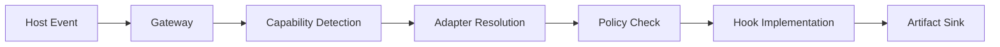

# Hook gateway

The gateway is the entry point for all host events (session-start, session-end, prompt-submit). It detects host capabilities, selects the appropriate adapter, and routes events through the policy chain before writing artifacts.

## Key source files

| File | Purpose |
|------|---------|
| `memory_core/tools/memory_hook_gateway.py` | Main gateway — receives events, resolves adapter, dispatches |
| `memory_core/tools/memory_hook_impls.py` | Hook implementations — context assembly, event logging |
| `memory_core/tools/factory_global_hooks.py` | Factory/Droid-specific hook bindings |

## How it works

1. Host fires an event (session-start, session-end, prompt-submit)
2. Gateway detects host capabilities (Factory only)
3. Adapter is resolved from `memory/system/adapter.toml` or `MEMORY_HOOK_ADAPTER` env var
4. Policy pack validates the event against allowed/denied rules
5. Implementation executes the hook logic
6. Artifacts are written to `memory/artifacts/`

## Entry points for modification

- To add a new host: create a new `*_global_hooks.py` file and register it in the gateway
- To change adapter behavior: modify `memory/system/adapter.toml` in the consumer project
- To add new policies: extend `memory/kb/global/policy-pack.json`
